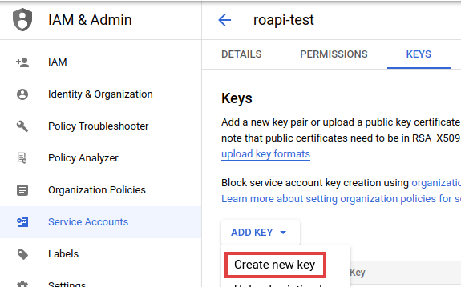

# Google spreadsheet

To serve a Google spreadsheet as API, you need to gather the following config values:

* Google spreadsheet URL, usually in the form of `https://docs.google.com/spreadsheets/d/{SPREADSHEET_ID}#gid={SHEET_ID}`.
* (Optional) Google spreadsheet sheet title (bottom of the spreadsheet UI).
This is required if `SHEET_ID` is not specified in URL through `#gid`.
* Google spreadsheet service account secret key.

Here are the steps to configure the service account:

1. [Activate Google Sheets API](https://console.developers.google.com/apis/library/sheets.googleapis.com) in the Google API Console.
1. Create a service account: [https://console.developers.google.com/apis/api/sheets.googleapis.com/credentials](https://console.developers.google.com/apis/api/sheets.googleapis.com/credentials).
1. Go into service account setting, click `ADD KEY` -> `Create new key`. Then select JSON format
   and save it somewhere safe as a file. 
1. Copy email address for your newly created service account, usually in the format of `{ACCOUNT_NAME}@{PROJECT_ID}.iam.gserviceaccount.com`. 
1. Open the Google spreadsheet that you want to serve, then share it with the newly created service
   account using the service account email. 


Now you can configure ROAPI to load the google spreadsheet into a table using:

```yaml
tables:
  - name: "table_name"
    uri: "https://docs.google.com/spreadsheets/d/1-lc4oij04aXzFSRMwVBLjU76s-K0-s6UPc2biOvtuuU#gid=0"
    option:
      format: "google_spreadsheet"
      application_secret_path: "path/to/service_account_key.json"
      # sheet_title is optional if `#gid` is specified in uri
      sheet_title: "sheet_name_within_google_spreadsheet"
```

ROAPI only invokes Google Sheets API during the initial data load, subsequent
query requests are served using in memory data.


## Example

Here is what it looks like to serve [this public google
spreadsheet](https://docs.google.com/spreadsheets/d/e/2PACX-1vRodiBkE77d8Y7FLe2BwwNNqy0jc3oSrtsGRrWMXXyAgdl68LxKm_LS0qfMVXa-ioPDP-5jurzKUJ0N/pubhtml)
with ROAPI.

Start server:

```
$ roapi-http -c local.yaml
[2021-03-01T00:08:03Z INFO  roapi_http::api] loading `https://docs.google.com/spreadsheets/d/1-lc4oij04aXzFSRMwVBLjU76s-K0-s6UPc2biOvtuuU#gid=0` as table `properties`
[2021-03-01T00:08:04Z INFO  roapi_http::api] registered `https://docs.google.com/spreadsheets/d/1-lc4oij04aXzFSRMwVBLjU76s-K0-s6UPc2biOvtuuU#gid=0` as table `properties`
[2021-03-01T00:08:04Z INFO  actix_server::builder] Starting 8 workers
[2021-03-01T00:08:04Z INFO  actix_server::builder] Starting "actix-web-service-127.0.0.1:8080" service on 127.0.0.1:8080
```

Query with aggregation ([SQL frontend](../../api/query/sql.html)):

```
$ curl -s -X POST -d "SELECT DISTINCT(Landlord), COUNT(Address) FROM properties GROUP BY Landlord" localhost:8080/api/sql | jq

[
  {
    "Landlord": "Daniel",
    "COUNT(Address)": 3
  },
  {
    "Landlord": "Mike",
    "COUNT(Address)": 4
  },
  {
    "Landlord": "Roger",
    "COUNT(Address)": 3
  },
  {
    "Landlord": "Sam",
    "COUNT(Address)": 2
  },
  {
    "Landlord": "Carl",
    "COUNT(Address)": 3
  }
]
```

Query with filter ([GraphQL frontend](../../api/query/graphql.html)):

```
$ curl -s -X POST localhost:8080/api/graphql -d @- <<EOF | jq
query {
  properties(
    filter: {
      Bed: { gt: 3 }
      Bath: { gte: 3 }
    }
    sort: [
      { field: "Bed", order: "desc" }
    ]
  ) {
    Address
    Bed
    Bath
  }
}
EOF

[
  {
    "Address": "Kenmore, WA",
    "Bed": 4,
    "Bath": 3,
    "Monthly_Rent": "$4,000"
  },
  {
    "Address": "Fremont, WA",
    "Bed": 5,
    "Bath": 3,
    "Monthly_Rent": "$4,500"
  }
]
```

Note: when inferring table schema from Google spreadsheets, ROAPI automatically
replaces spaces in column names with `_`(underscore).
